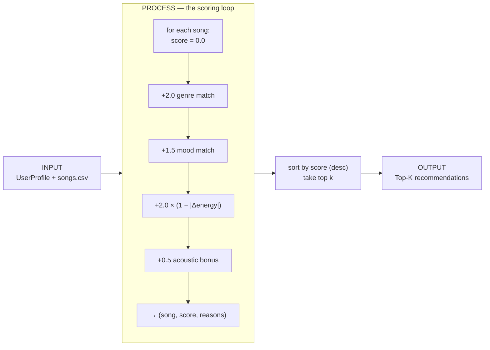

# 🎵 Music Recommender Simulation

## Project Summary

In this project you will build and explain a small music recommender system.

Your goal is to:

- Represent songs and a user "taste profile" as data
- Design a scoring rule that turns that data into recommendations
- Evaluate what your system gets right and wrong
- Reflect on how this mirrors real world AI recommenders

Replace this paragraph with your own summary of what your version does.

---

## How The System Works

Real world streaming platforms like Spotify and Apple Music predict what you'll enjoy by blending several signals: your listening behavior (plays, skips, saves), the tastes of users similar to you (collaborative filtering), and the measurable qualities of the music itself such as genre, tempo, and energy (content-based filtering). Most large services combine these into a hybrid model to balance discovery with personalization. My version keeps things intentionally simple and focuses purely on **content-based filtering**: it compares the audio features of each song against a user's stated taste profile. It prioritizes *closeness of fit* — matching a listener's preferred genre and mood exactly, while scoring numerical features like energy by how near a song sits to the user's target value rather than favoring higher or lower numbers. In short, my recommender aims to answer "which songs feel most like what this user asked for?" using transparent, explainable scoring instead of hidden crowd data.

### What features does each `Song` use

Each song carries nine fields, but only some drive the scoring:

- **`genre`** *(categorical)* — exact-match against the user's favorite genre
- **`mood`** *(categorical)* — exact-match against the user's favorite mood
- **`energy`** *(0–1)* — proximity score: how close the song sits to the user's target energy
- **`acousticness`** *(0–1)* — used to satisfy the user's acoustic preference
- **`tempo_bpm`** *(60–152)*, **`valence`** *(0–1)*, **`danceability`** *(0–1)* — additional numeric features available for scoring (tempo must be scaled to 0–1 first)
- **`id`, `title`, `artist`** — identity/display only, not scored

### What information does your `UserProfile` store

- **`favorite_genre`** *(str)* — compared against `Song.genre`
- **`favorite_mood`** *(str)* — compared against `Song.mood`
- **`target_energy`** *(0–1)* — the ideal energy level, compared against `Song.energy`
- **`likes_acoustic`** *(bool)* — when true, acoustic songs get a bonus

### How the `Recommender` computes a score

For each song it starts at `0.0` and adds weighted points: a fixed bonus for a genre match, a fixed bonus for a mood match, and a proximity score for energy using `1 - abs(song.energy - user.target_energy)`. Each match also records a plain-English reason used for the explanation.

### How songs are chosen

Every song is scored, the list is sorted by score (highest first), and the top `k` are returned as the recommendations.

### Data flow

The system moves a single song from the CSV to a ranked list in three stages:



### Algorithm Recipe (finalized)

Each song starts at `0.0`. Points accumulate as follows:

| Signal | Points | Rationale |
|---|---|---|
| **Genre match** | `+2.0` | Coarse filter — the largest single bucket, but not decisive on its own |
| **Mood match** | `+1.5` | Weighted above the common `1.0` so mood + energy together can outrank a genre-only match |
| **Energy similarity** | `+2.0 × (1 − \|song.energy − target_energy\|)` | Continuous proximity score; rewards near-misses instead of a hard threshold |
| **Acoustic bonus** | `+0.5` when `likes_acoustic` is true and `acousticness ≥ 0.7` | A gentle nudge toward acoustic tracks for users who want them |

*Sanity check:* for a `pop` / `happy` / `0.8` user, a pop-happy-0.8 song scores `2.0 + 1.5 + 2.0 = 5.5`, while a lofi-chill-0.4 song scores `2.0 × (1 − 0.4) = 1.2`.

### Potential biases I expect

- **Genre lock-in.** Genre is the biggest single bucket (`+2.0`), so the system may over-prioritize genre and bury genuinely great cross-genre songs that match the user's mood and energy perfectly. A jazz track ideal in every way except genre can lose to a mediocre in-genre one.
- **Exact-match blind spots.** Genre and mood are matched as exact strings. A user who likes `"indie pop"` gets nothing from an `"indie"` or `"pop"` song, and near-synonym moods (`chill` vs `relaxed`) never reward each other — so the taste profile is judged more literally than a person would judge it.
- **Popularity/catalog invisibility.** With only content features and no play counts, the recommender can't distinguish a beloved song from an ignored one; it also can only recommend what's in this tiny catalog, so sparse genres get thin, repetitive results.
- **Mainstream-target drift.** Energy is scored by closeness to a single target, which quietly favors songs clustered near common values and penalizes users with extreme (very low or very high energy) tastes, since fewer catalog songs sit near their target.

---

## Getting Started

### Setup

1. Create a virtual environment (optional but recommended):

   ```bash
   python -m venv .venv
   source .venv/bin/activate      # Mac or Linux
   .venv\Scripts\activate         # Windows

2. Install dependencies

```bash
pip install -r requirements.txt
```

3. Run the app:

```bash
python -m src.main
```

### Running Tests

Run the starter tests with:

```bash
pytest
```

You can add more tests in `tests/test_recommender.py`.

---

## Sample Recommendation Output

Running `python -m src.main` with the default **pop / happy / 0.8** profile produces:

```
Loaded songs: 10

====================================================
  TOP RECOMMENDATIONS
  For profile: genre=pop, mood=happy, energy=0.8
====================================================

1. Sunrise City - Neon Echo   (score: 5.46)
     - genre match: pop (+2.0)
     - mood match: happy (+1.5)
     - energy 0.82 vs target 0.80 (+1.96)

2. Gym Hero - Max Pulse   (score: 3.74)
     - genre match: pop (+2.0)
     - energy 0.93 vs target 0.80 (+1.74)

3. Rooftop Lights - Indigo Parade   (score: 3.42)
     - mood match: happy (+1.5)
     - energy 0.76 vs target 0.80 (+1.92)

4. Night Drive Loop - Neon Echo   (score: 1.90)
     - energy 0.75 vs target 0.80 (+1.90)

5. Storm Runner - Voltline   (score: 1.78)
     - energy 0.91 vs target 0.80 (+1.78)
```

The ranking matches expectations: **Sunrise City** wins decisively as the only song matching genre *and* mood *and* near-target energy. Notice **Gym Hero** (pop, genre-only) still edges out **Rooftop Lights** (happy + better energy fit) — a live example of the genre-priority bias noted above.

**Screenshot or video** *(optional)*: <!-- Insert a screenshot or demo video link here -->

---

## Experiments You Tried

Use this section to document the experiments you ran. For example:

- What happened when you changed the weight on genre from 2.0 to 0.5
- What happened when you added tempo or valence to the score
- How did your system behave for different types of users

---

## Limitations and Risks

Summarize some limitations of your recommender.

Examples:

- It only works on a tiny catalog
- It does not understand lyrics or language
- It might over favor one genre or mood

You will go deeper on this in your model card.

---

## Reflection

Read and complete `model_card.md`:

[**Model Card**](model_card.md)

Write 1 to 2 paragraphs here about what you learned:

- about how recommenders turn data into predictions
- about where bias or unfairness could show up in systems like this


