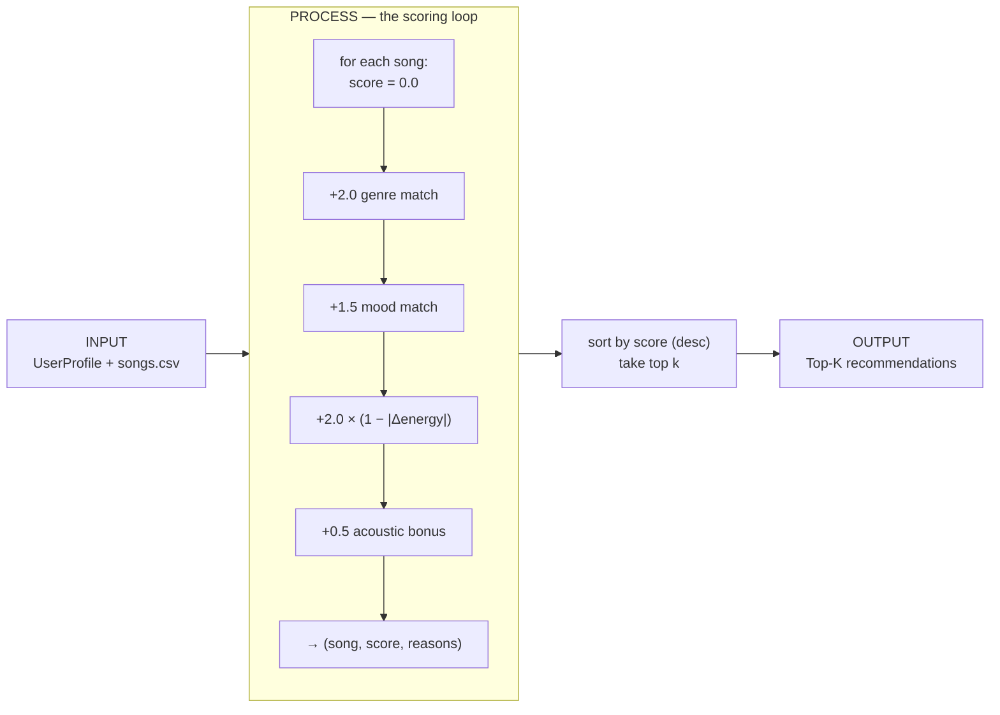

# 🎵 Music Recommender Simulation

## Project Summary

In this project you will build and explain a small music recommender system.

Your goal is to:

- Represent songs and a user "taste profile" as data
- Design a scoring rule that turns that data into recommendations
- Evaluate what your system gets right and wrong
- Reflect on how this mirrors real world AI recommenders

Replace this paragraph with your own summary of what your version does.

---

## How The System Works

Real world streaming platforms like Spotify and Apple Music predict what you'll enjoy by blending several signals: your listening behavior (plays, skips, saves), the tastes of users similar to you (collaborative filtering), and the measurable qualities of the music itself such as genre, tempo, and energy (content-based filtering). Most large services combine these into a hybrid model to balance discovery with personalization. My version keeps things intentionally simple and focuses purely on **content-based filtering**: it compares the audio features of each song against a user's stated taste profile. It prioritizes *closeness of fit* — matching a listener's preferred genre and mood exactly, while scoring numerical features like energy by how near a song sits to the user's target value rather than favoring higher or lower numbers. In short, my recommender aims to answer "which songs feel most like what this user asked for?" using transparent, explainable scoring instead of hidden crowd data.

### What features does each `Song` use

Each song carries nine fields, but only some drive the scoring:

- **`genre`** *(categorical)* — exact-match against the user's favorite genre
- **`mood`** *(categorical)* — exact-match against the user's favorite mood
- **`energy`** *(0–1)* — proximity score: how close the song sits to the user's target energy
- **`acousticness`** *(0–1)* — used to satisfy the user's acoustic preference
- **`tempo_bpm`** *(60–152)*, **`valence`** *(0–1)*, **`danceability`** *(0–1)* — additional numeric features available for scoring (tempo must be scaled to 0–1 first)
- **`id`, `title`, `artist`** — identity/display only, not scored

### What information does your `UserProfile` store

- **`favorite_genre`** *(str)* — compared against `Song.genre`
- **`favorite_mood`** *(str)* — compared against `Song.mood`
- **`target_energy`** *(0–1)* — the ideal energy level, compared against `Song.energy`
- **`likes_acoustic`** *(bool)* — when true, acoustic songs get a bonus

### How the `Recommender` computes a score

For each song it starts at `0.0` and adds weighted points: a fixed bonus for a genre match, a fixed bonus for a mood match, and a proximity score for energy using `1 - abs(song.energy - user.target_energy)`. Each match also records a plain-English reason used for the explanation.

### How songs are chosen

Every song is scored, the list is sorted by score (highest first), and the top `k` are returned as the recommendations.

### Data flow

The system moves a single song from the CSV to a ranked list in three stages:



### Algorithm Recipe (finalized)

Each song starts at `0.0`. Points accumulate as follows:

| Signal | Points | Rationale |
|---|---|---|
| **Genre match** | `+2.0` | Coarse filter — the largest single bucket, but not decisive on its own |
| **Mood match** | `+1.5` | Weighted above the common `1.0` so mood + energy together can outrank a genre-only match |
| **Energy similarity** | `+2.0 × (1 − \|song.energy − target_energy\|)` | Continuous proximity score; rewards near-misses instead of a hard threshold |
| **Acoustic bonus** | `+0.5` when `likes_acoustic` is true and `acousticness ≥ 0.7` | A gentle nudge toward acoustic tracks for users who want them |

*Sanity check:* for a `pop` / `happy` / `0.8` user, a pop-happy-0.8 song scores `2.0 + 1.5 + 2.0 = 5.5`, while a lofi-chill-0.4 song scores `2.0 × (1 − 0.4) = 1.2`.

### Potential biases I expect

- **Genre lock-in.** Genre is the biggest single bucket (`+2.0`), so the system may over-prioritize genre and bury genuinely great cross-genre songs that match the user's mood and energy perfectly. A jazz track ideal in every way except genre can lose to a mediocre in-genre one.
- **Exact-match blind spots.** Genre and mood are matched as exact strings. A user who likes `"indie pop"` gets nothing from an `"indie"` or `"pop"` song, and near-synonym moods (`chill` vs `relaxed`) never reward each other — so the taste profile is judged more literally than a person would judge it.
- **Popularity/catalog invisibility.** With only content features and no play counts, the recommender can't distinguish a beloved song from an ignored one; it also can only recommend what's in this tiny catalog, so sparse genres get thin, repetitive results.
- **Mainstream-target drift.** Energy is scored by closeness to a single target, which quietly favors songs clustered near common values and penalizes users with extreme (very low or very high energy) tastes, since fewer catalog songs sit near their target.

---

## Getting Started

### Setup

1. Create a virtual environment (optional but recommended):

   ```bash
   python -m venv .venv
   source .venv/bin/activate      # Mac or Linux
   .venv\Scripts\activate         # Windows

2. Install dependencies

```bash
pip install -r requirements.txt
```

3. Run the app:

```bash
python -m src.main
```

### Running Tests

Run the starter tests with:

```bash
pytest
```

You can add more tests in `tests/test_recommender.py`.

---

## Sample Recommendation Output

Running `python -m src.main` with the default **pop / happy / 0.8** profile produces:

```
Loaded songs: 10

====================================================
  TOP RECOMMENDATIONS
  For profile: genre=pop, mood=happy, energy=0.8
====================================================

1. Sunrise City - Neon Echo   (score: 5.46)
     - genre match: pop (+2.0)
     - mood match: happy (+1.5)
     - energy 0.82 vs target 0.80 (+1.96)

2. Gym Hero - Max Pulse   (score: 3.74)
     - genre match: pop (+2.0)
     - energy 0.93 vs target 0.80 (+1.74)

3. Rooftop Lights - Indigo Parade   (score: 3.42)
     - mood match: happy (+1.5)
     - energy 0.76 vs target 0.80 (+1.92)

4. Night Drive Loop - Neon Echo   (score: 1.90)
     - energy 0.75 vs target 0.80 (+1.90)

5. Storm Runner - Voltline   (score: 1.78)
     - energy 0.91 vs target 0.80 (+1.78)
```

The ranking matches expectations: **Sunrise City** wins decisively as the only song matching genre *and* mood *and* near-target energy. Notice **Gym Hero** (pop, genre-only) still edges out **Rooftop Lights** (happy + better energy fit) — a live example of the genre-priority bias noted above.

**Screenshot or video** *(optional)*: <!-- Insert a screenshot or demo video link here -->

---

## System Evaluation: Profile Recommendations

Running `python -m src.main` now scores the catalog against **seven** taste
profiles: three coherent "normal" listeners, then four **adversarial /
edge-case** profiles built to see whether the scoring logic can be tricked.
All output below is the real terminal output, top 5 per profile.

### Normal profiles

**High-Energy Pop** — `genre=pop, mood=happy, energy=0.9`

```
============================================================
  High-Energy Pop
  Profile: genre=pop, mood=happy, energy=0.9
============================================================

1. Sunrise City - Neon Echo   (score: 5.34)
     - genre match: pop (+2.0)
     - mood match: happy (+1.5)
     - energy 0.82 vs target 0.90 (+1.84)

2. Gym Hero - Max Pulse   (score: 3.94)
     - genre match: pop (+2.0)
     - energy 0.93 vs target 0.90 (+1.94)

3. Rooftop Lights - Indigo Parade   (score: 3.22)
     - mood match: happy (+1.5)
     - energy 0.76 vs target 0.90 (+1.72)

4. Storm Runner - Voltline   (score: 1.98)
     - energy 0.91 vs target 0.90 (+1.98)

5. Pulse Reactor - Circuit Bloom   (score: 1.96)
     - energy 0.88 vs target 0.90 (+1.96)
```

**Chill Lofi** — `genre=lofi, mood=chill, energy=0.35, likes_acoustic=True`

```
============================================================
  Chill Lofi
  Profile: genre=lofi, mood=chill, energy=0.35, likes_acoustic=True
============================================================

1. Library Rain - Paper Lanterns   (score: 6.00)
     - genre match: lofi (+2.0)
     - mood match: chill (+1.5)
     - energy 0.35 vs target 0.35 (+2.00)
     - acoustic pick: acousticness 0.86 (+0.5)

2. Midnight Coding - LoRoom   (score: 5.86)
     - genre match: lofi (+2.0)
     - mood match: chill (+1.5)
     - energy 0.42 vs target 0.35 (+1.86)
     - acoustic pick: acousticness 0.71 (+0.5)

3. Focus Flow - LoRoom   (score: 4.40)
     - genre match: lofi (+2.0)
     - energy 0.40 vs target 0.35 (+1.90)
     - acoustic pick: acousticness 0.78 (+0.5)

4. Spacewalk Thoughts - Orbit Bloom   (score: 3.86)
     - mood match: chill (+1.5)
     - energy 0.28 vs target 0.35 (+1.86)
     - acoustic pick: acousticness 0.92 (+0.5)

5. Coffee Shop Stories - Slow Stereo   (score: 2.46)
     - energy 0.37 vs target 0.35 (+1.96)
     - acoustic pick: acousticness 0.89 (+0.5)
```

**Deep Intense Rock** — `genre=rock, mood=intense, energy=0.9`

```
============================================================
  Deep Intense Rock
  Profile: genre=rock, mood=intense, energy=0.9
============================================================

1. Storm Runner - Voltline   (score: 5.48)
     - genre match: rock (+2.0)
     - mood match: intense (+1.5)
     - energy 0.91 vs target 0.90 (+1.98)

2. Gym Hero - Max Pulse   (score: 3.44)
     - mood match: intense (+1.5)
     - energy 0.93 vs target 0.90 (+1.94)

3. Pulse Reactor - Circuit Bloom   (score: 1.96)
     - energy 0.88 vs target 0.90 (+1.96)

4. Iron Verdict - Ashfall   (score: 1.88)
     - energy 0.96 vs target 0.90 (+1.88)

5. Sunrise City - Neon Echo   (score: 1.84)
     - energy 0.82 vs target 0.90 (+1.84)
```

### Adversarial / edge-case profiles

I asked my AI coding assistant to design profiles that stress the scoring
rule. Each targets a specific weakness; the observed behavior is noted under
each block.

**1. Conflicting signals — "hyped but sad"** — `genre=classical, mood=melancholy, energy=0.95`

The profile wants maximum energy *and* a low-energy, downbeat mood — two pulls
that cannot both be satisfied.

```
============================================================
  Conflicting: hyped but sad
  Profile: genre=classical, mood=melancholy, energy=0.95
============================================================

1. Moonlit Sonata Redux - Clara Vale   (score: 4.22)
     - genre match: classical (+2.0)
     - mood match: melancholy (+1.5)
     - energy 0.31 vs target 0.95 (+0.72)

2. Iron Verdict - Ashfall   (score: 1.98)
     - energy 0.96 vs target 0.95 (+1.98)

3. Gym Hero - Max Pulse   (score: 1.96)
     - energy 0.93 vs target 0.95 (+1.96)

4. Storm Runner - Voltline   (score: 1.92)
     - energy 0.91 vs target 0.95 (+1.92)

5. Pulse Reactor - Circuit Bloom   (score: 1.86)
     - energy 0.88 vs target 0.95 (+1.86)
```

> **What it revealed:** the categorical bonuses (`+3.5` total) outweigh the
> energy term, so a *slow, sad* piano piece wins for a user who asked for high
> energy. The genre+mood match dominates and the energy mismatch (only `+0.72`
> of a possible `+2.0`) is silently absorbed. Rank #1 is technically the "best
> fit" but arguably not what a hyped listener wants — the scoring can't detect
> that the request itself is contradictory.

**2. Out-of-range energy** — `genre=metal, mood=angry, energy=2.0`

Energy is supposed to live in `0-1`. Feeding `2.0` pushes the proximity term
`2.0 × (1 − |song − target|)` negative.

```
============================================================
  Out-of-range energy
  Profile: genre=metal, mood=angry, energy=2.0
============================================================

1. Iron Verdict - Ashfall   (score: 3.42)
     - genre match: metal (+2.0)
     - mood match: angry (+1.5)
     - energy 0.96 vs target 2.00 (+-0.08)

2. Gym Hero - Max Pulse   (score: -0.14)
     - energy 0.93 vs target 2.00 (+-0.14)

3. Storm Runner - Voltline   (score: -0.18)
     - energy 0.91 vs target 2.00 (+-0.18)

4. Pulse Reactor - Circuit Bloom   (score: -0.24)
     - energy 0.88 vs target 2.00 (+-0.24)

5. Sunrise City - Neon Echo   (score: -0.36)
     - energy 0.82 vs target 2.00 (+-0.36)
```

> **What it revealed:** nothing clamps or validates the input, so the energy
> term becomes a **penalty** and songs drop to *negative* scores (note the
> malformed `+-0.08` reason string, too). The genre+mood match still floats
> Iron Verdict to #1, but the whole list is now ranked by "least penalized."
> A real system should validate `0 ≤ energy ≤ 1` on the way in.

**3. Unknown genre & mood** — `genre=polka, mood=ecstatic, energy=0.5`

Categories that appear nowhere in the catalog.

```
============================================================
  Unknown genre & mood
  Profile: genre=polka, mood=ecstatic, energy=0.5
============================================================

1. Dust and Diesel - Wade Harlan   (score: 1.96)
     - energy 0.48 vs target 0.50 (+1.96)

2. Velvet Hours - Simone Ray   (score: 1.96)
     - energy 0.52 vs target 0.50 (+1.96)

3. Island Time - Coral Sound   (score: 1.90)
     - energy 0.55 vs target 0.50 (+1.90)

4. Midnight Coding - LoRoom   (score: 1.84)
     - energy 0.42 vs target 0.50 (+1.84)

5. Focus Flow - LoRoom   (score: 1.80)
     - energy 0.40 vs target 0.50 (+1.80)
```

> **What it revealed:** both categorical bonuses silently evaluate to zero and
> ranking collapses to **pure energy proximity**. The user's stated genre/mood
> contribute nothing yet trigger no warning — the system happily returns
> confident-looking picks that ignore two of the three preferences. Note the
> exact tie at `1.96` (#1 vs #2) resolved only by catalog order.

**4. Empty profile** — `{}`

No preferences at all.

```
============================================================
  Empty profile
  Profile: (empty - no preferences)
============================================================

1. Sunrise City - Neon Echo   (score: 0.00)
     - no matching features

2. Midnight Coding - LoRoom   (score: 0.00)
     - no matching features

3. Storm Runner - Voltline   (score: 0.00)
     - no matching features

4. Library Rain - Paper Lanterns   (score: 0.00)
     - no matching features

5. Gym Hero - Max Pulse   (score: 0.00)
     - no matching features
```

> **What it revealed:** every song scores exactly `0.00`, so the "top 5" is
> just the **first five rows of the CSV** (the sort is stable). The system
> gives no signal that it has zero basis for its recommendations — a
> best-guess ranking is indistinguishable from a confident one.

**Takeaways for the model card:** the scoring rule is transparent but *too
trusting* — it never validates input ranges, never flags unknown categories,
and treats ties and zero-information cases as if they were real rankings.
Fixes worth noting: clamp/validate energy to `0-1`, warn when a genre/mood
matches nothing in the catalog, and surface a low-confidence flag when the top
score is at or near `0`.

---

## Experiments You Tried

Use this section to document the experiments you ran. For example:

- What happened when you changed the weight on genre from 2.0 to 0.5
- What happened when you added tempo or valence to the score
- How did your system behave for different types of users

### Accuracy & Surprises — auditing the "High-Energy Pop" profile

I compared the recommendations for `genre=pop, mood=happy, energy=0.9` against
my own musical intuition:

```
1. Sunrise City      5.34   (pop + happy + energy 0.82)
2. Gym Hero          3.94   (pop + energy 0.93)
3. Rooftop Lights    3.22   (happy + energy 0.76)
4. Storm Runner      1.98   (energy only)
5. Pulse Reactor     1.96   (energy only)
```

**The #1 pick feels right.** Sunrise City is the only track that matches genre
*and* mood *and* sits near the target energy, so it wins decisively.

**The surprise is #2 vs #3.** Intuitively a *happy* song near the target energy
(Rooftop Lights: happy, 0.76) is a better fit for a "happy" listener than a
*not-happy* pop song (Gym Hero: `intense`, 0.93) — yet Gym Hero wins by 0.72.
This is the **genre-priority bias** showing up live: a `+2.0` genre match
outweighs a `+1.5` mood match even when the mood is flatly wrong.

**Why Sunrise City ranked first, traced through the weights in `recommender.py`:**

| Signal | Rule | Sunrise City | Gym Hero |
|---|---|---|---|
| Genre `+2.0` | exact match | pop ✓ **+2.0** | pop ✓ **+2.0** |
| Mood `+1.5` | exact match | happy ✓ **+1.5** | intense ✗ **0** |
| Energy `2.0×(1−\|Δ\|)` | proximity to 0.9 | \|0.82−0.9\| → **+1.84** | \|0.93−0.9\| → **+1.94** |
| **Total** | | **5.34** | **3.94** |

Note that Gym Hero actually scores *higher* on energy (1.94 vs 1.84) — the
entire 1.40-point gap comes from the **mood match alone**. The categorical
bonuses, not the continuous energy term, decide the ranking.

**Does one song dominate every list?** No. The #1 slot changes per profile
(Sunrise City → Library Rain → Storm Runner → Moonlit Sonata Redux → …), so the
genre weight is not so strong that a single song wins everything. The real
symptom of the tiny 17-song catalog is different: **the top 5 is thin** — only
1–2 true matches per profile, with the rest padded by energy-proximity filler
and even exact score ties (e.g. the `1.96` tie in the "Unknown genre & mood"
profile).

### Sensitivity experiment — Weight Shift (2× energy, ½ genre)

**Change tested:** in `score_song()`, double the energy weight (`2.0 → 4.0`)
and halve the genre weight (`2.0 → 1.0`); mood left at `1.5`. Applied
temporarily, then reverted to the finalized recipe. `pytest` still passed under
the new weights, confirming the math stayed valid (no negative-total or
ordering regressions on the test songs).

Watching the **High-Energy Pop** profile (`pop / happy / 0.9`):

| Rank | Before (finalized 2.0 / 1.5 / 2.0) | After (experiment 1.0 / 1.5 / 4.0) |
|---|---|---|
| 1 | Sunrise City — 5.34 | Sunrise City — 6.18 |
| 2 | **Gym Hero — 3.94** *(pop, `intense`)* | **Rooftop Lights — 4.94** *(happy)* |
| 3 | Rooftop Lights — 3.22 | **Gym Hero — 4.88** *(pop, `intense`)* |
| 4 | Storm Runner — 1.98 | Storm Runner — 3.96 |
| 5 | Pulse Reactor — 1.96 | Pulse Reactor — 3.92 |

Experiment output for the flipped pair:

```
1. Sunrise City - Neon Echo   (score: 6.18)
     - genre match: pop (+1.0)
     - mood match: happy (+1.5)
     - energy 0.82 vs target 0.90 (+3.68)

2. Rooftop Lights - Indigo Parade   (score: 4.94)
     - mood match: happy (+1.5)
     - energy 0.76 vs target 0.90 (+3.44)

3. Gym Hero - Max Pulse   (score: 4.88)
     - genre match: pop (+1.0)
     - energy 0.93 vs target 0.90 (+3.88)
```

**More accurate, or just different?** For *this* profile it's **more accurate**:
the flip is exactly the fix for the genre-priority bias I flagged above — a
*happy* song (Rooftop Lights) now beats a genre-only, wrong-mood pop track
(Gym Hero), which matches how a person would rank "happy high-energy pop."

But it's a trade, not a free win. Quadrupling energy's ceiling (`0 → 4.0`)
makes energy proximity the loudest signal in the whole rule, so the tail (#4,
#5) is now packed even tighter with cross-genre songs whose *only* virtue is
sitting near 0.9 — Storm Runner (rock) and Pulse Reactor (electronic) jump from
~1.9 to ~3.9 and crowd out anything genre/mood-relevant. So the change sharpens
the *head* of the list for mood-sensitive users while making the *tail* more
genre-blind. The finalized recipe keeps genre at `2.0` as a deliberate coarse
filter; this experiment shows that choice is what produces the very bias
documented above — a tunable, not a bug.

---

## Limitations and Risks

Summarize some limitations of your recommender.

Examples:

- It only works on a tiny catalog
- It does not understand lyrics or language
- It might over favor one genre or mood

You will go deeper on this in your model card.

---

## Reflection

Read and complete `model_card.md`:

[**Model Card**](model_card.md)

Write 1 to 2 paragraphs here about what you learned:

- about how recommenders turn data into predictions
- about where bias or unfairness could show up in systems like this


